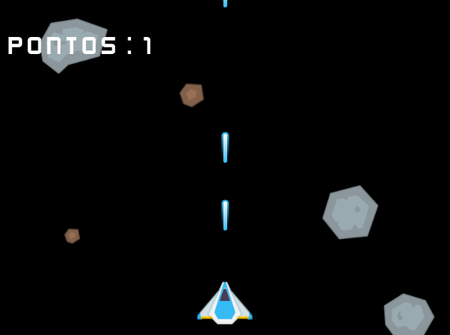

# Criação de jogo 2D em Go
Repositório dedicado a criação do meu primeiro jogo 2D com a biblioteca Ebitengine do Go.

### Biblioteca utilizada:
A Ebitengine é especifica para jogos 2D no Go.

### A Interface do jogo:

